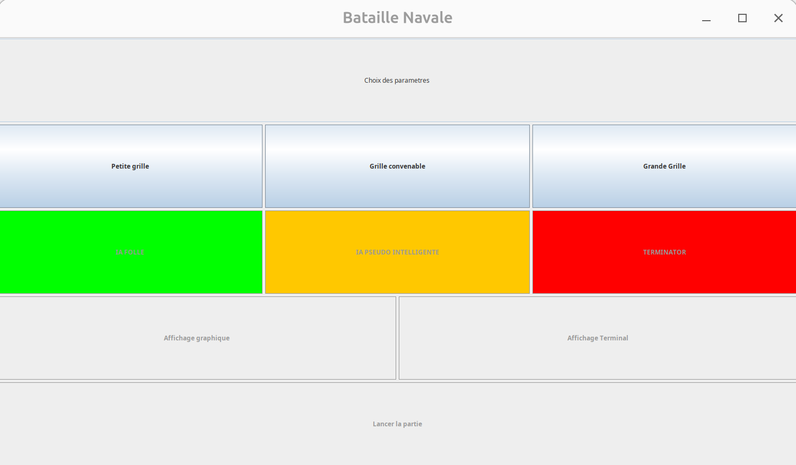
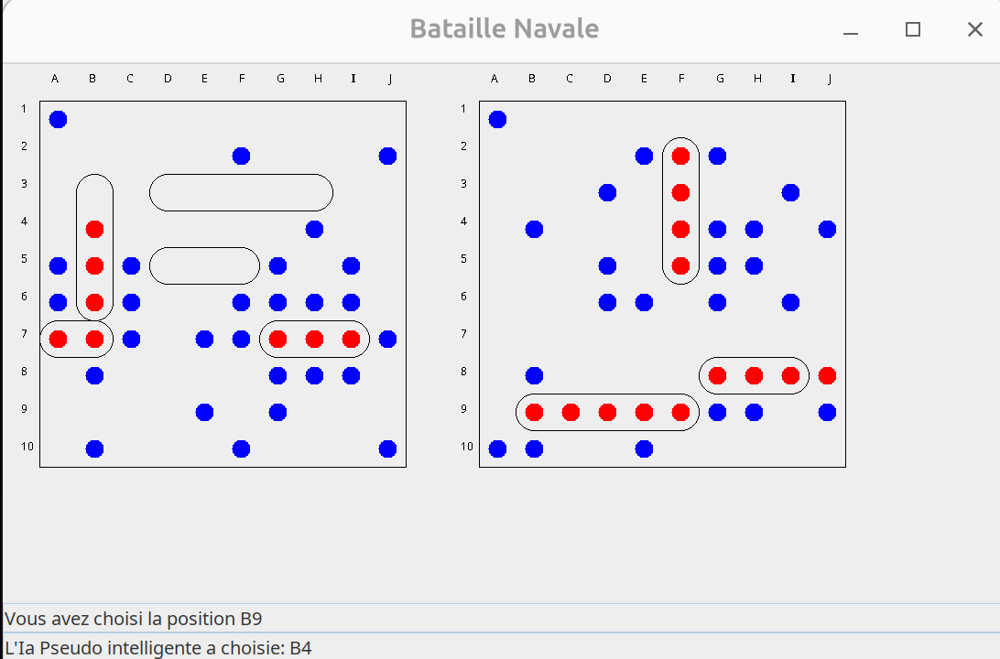
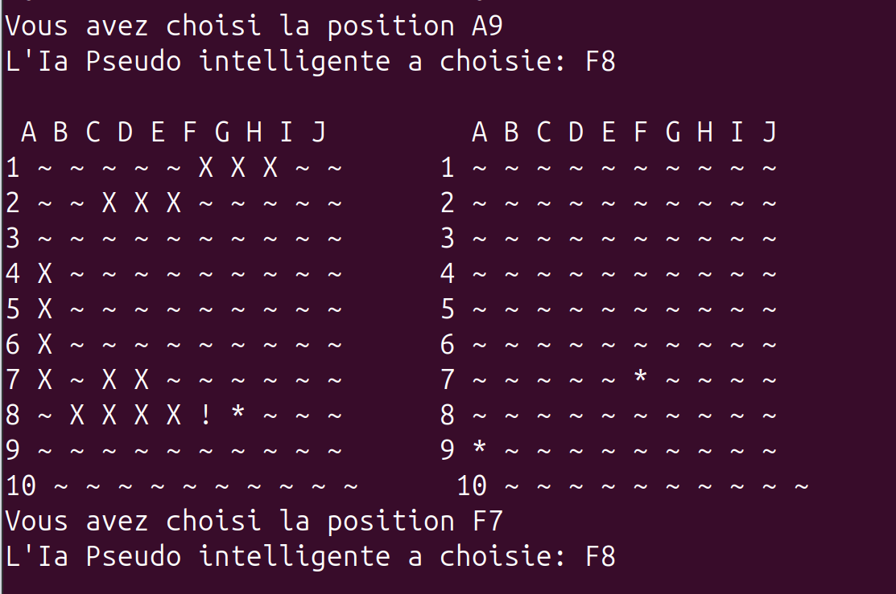

# Bataille Navale - Java MVC


> **Projet Universitaire (L2 Informatique)**
> *Implémentation complète du jeu de société Bataille Navale avec IA avancée et interface graphique.*

Ce projet propose une version robuste et modulaire de la Bataille Navale, développée en respectant le patron de conception **MVC (Modèle-Vue-Contrôleur)**. Il permet d'affronter l'ordinateur via une interface graphique interactive ou en ligne de commande, avec plusieurs niveaux de difficulté.

---
##  Aperçu du jeu
### Écran d'accueil et configuration
Aperçu du menu principal permettant de paramétrer la partie (taille de grille, difficulté, modes).



---

### Affrontement en cours (Mode Graphique)
Visualisation de la grille de jeu interactive (Swing). Rouge pour touché, bleu pour à l'eau.



---
### Affrontement en cours (Mode Terminal)

Aperçu de l'interface en ligne de commande .



---
## Fonctionnalités Implémentées :
* **Architecture MVC :** Séparation  entre la logique métier , l'affichage et le contrôle pour une maintenabilité maximale.
* **Double Interface :**
     * **Mode Terminal :** Interface en ligne de commande (CLI) via saisie textuelle (ex: "A1").
     * **Mode Graphique (GUI) :** Interface interactive à la souris avec visualisation des tirs (rouge pour touché, bleu pour à l'eau).
* **Personnalisation  :**
    * Sélection de la dimension de la grille : Petite (5x5), Moyenne (10x10) ou Grande (15x15).
    * Gestion dynamique de la flotte selon l'espace de jeu .

---

##  Intelligence Artificielle (IA)

Le jeu propose 3 intelligences artificielles de difficulté progressive:

| Niveau | IA | Description et Stratégie |
| :--- | :--- | :--- |
| **Facile** | `IaFolle` | **Tir Aléatoire.** Elle tire n'importe où sur la grille sans aucune stratégie. Idéal pour débuter. |
| **Normal** | `IaPseudoIntelligente` | **Chasse & Destruction.** Elle cherche en damier. Dès qu'elle touche un navire, elle passe en mode "traque" et tire en croix autour de la cible jusqu'à la couler. |
| **Impossible** | `TERMINATOR` | **Omnisciente.** Elle connait la position exacte de tous vos bateaux dès le début. La victoire est mathématiquement impossible. |

---

##  Installation & Exécution
Les commandes suivantes doivent être exécutées depuis la **racine** du projet .

### 1. Compilation:
Les fichiers sources sont compilés et placés dans le répertoire dist.

```bash
javac -d dist src/game/ecouteur/*.java src/game/vue/*.java src/game/modele/jeu/*.java src/game/modele/joueur/*.java src/game/modele/terrain/*.java
```
### 2.Exécution :
Une fois la compilation effectuée , lancez le jeu avec la commande suivante : 
```
java -cp dist/ game.modele.jeu.Main
```

### 3.Documentation Technique :
La documentation complète du code est disponible et peut être générée avec la ligne de commande qui suit  :
```
javadoc -d javadoc -sourcepath src -subpackages game
```
### 4.Equipe de developpement : 
    Lena REZGUI
    Lamairi Mohamed Yassine
    Grysan Alan
    Le Basnier Audrey
